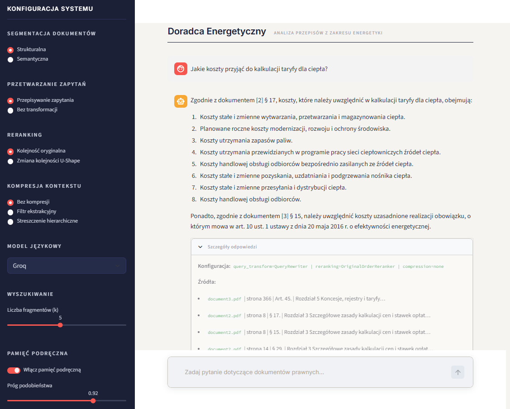
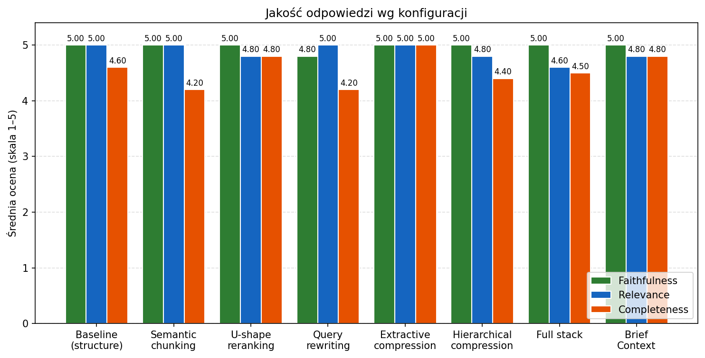
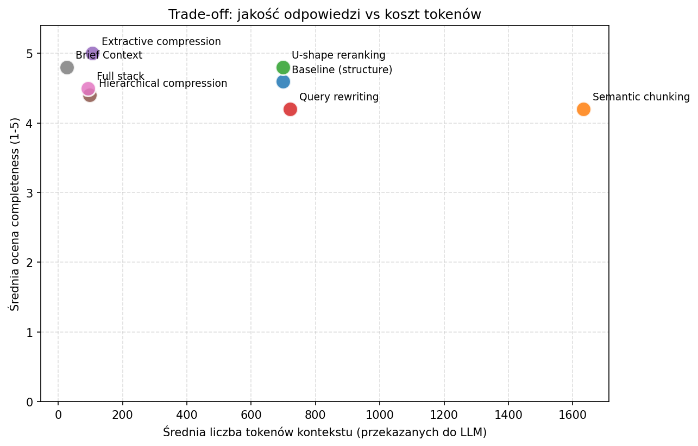
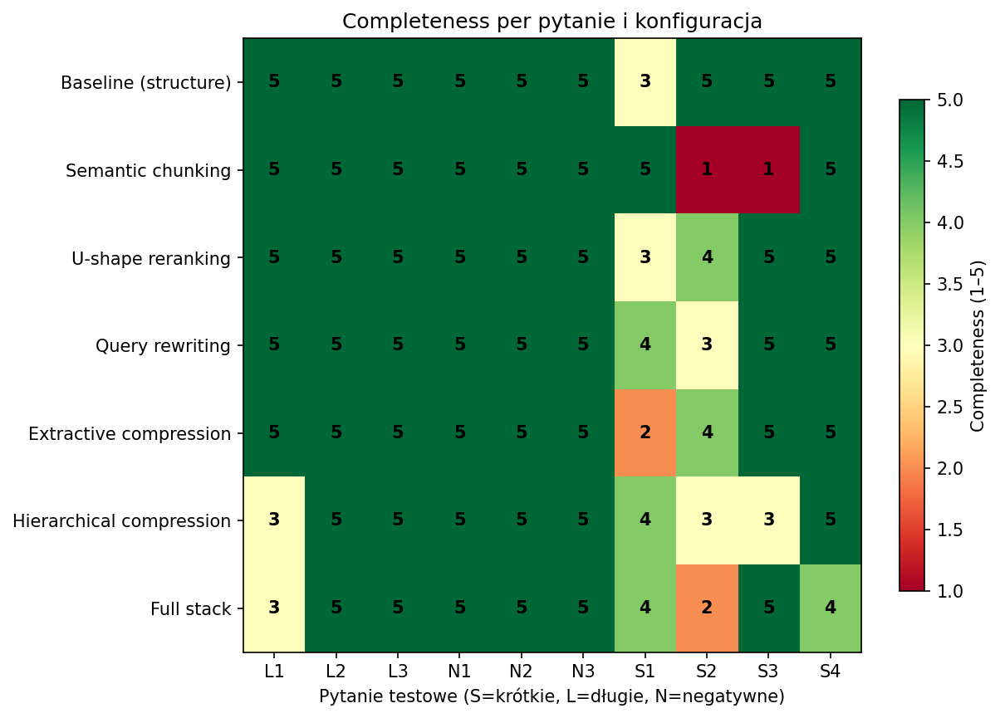
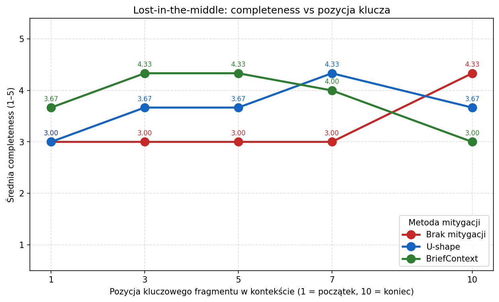

# NLP - dokumentacja projektu
## Context Engineering - zaawansowane zarządzanie kontekstem

Implementacja i ewaluacja technik zaawansowanego zarządzania kontekstem (context engineering) w systemach agentowych/RAG.

### Zadania:
- Zbadać i zaimplementować system konwersacyjny (np. czat) obsługujący zarządzanie długim kontekstem (np. kilkunasto/kilkudziesięcio stronicowe dokumenty, >10 tys. tokenów per dokument) z wybranymi technikami np. semantic chunking, document structure-based chunking w wybranej dziedzinie (np. inżynieria, IT, programowanie itp.)
- Zaimplementować wybraną metodę query understanding np. query rewriter
- Porównać co najmniej 2 strategie context engineering np. context compression/summarizing, hierarchical summarization
- Zbadanie oraz zaimplementowanie wybranej metody context cache/semantic cache
- Zbadanie problemu "Lost-in-the-middle" i sposobów jego mitygacji

## Zespół projektowy:
- Natalia Choszczyk
- Filip Langiewicz
- Mikołaj Rowicki

## Definicja problemu

Kluczowym wyzwaniem współczesnych systemów RAG jest efektywne zarządzanie długim kontekstem, modele językowe dysponują skończonym oknem kontekstowym i nie są w stanie przetworzyć obszernych dokumentów w całości. Projekt skupia się na domenie prawnej, gdzie akty, kodeksy i regulaminy liczą dziesiątki lub setki stron, a precyzja i kompletność odpowiedzi ma szczególne znaczenie. W tym kontekście identyfikujemy następujące problemy:

- **Zarządzanie długim kontekstem:** dokumenty prawne przekraczające 10 000 tokenów wymagają podziału na fragmenty. Standardowy podział stałej długości nie uwzględnia struktury prawnej dokumentu, co prowadzi do rozbicia logicznie powiązanych przepisów i utraty kontekstu semantycznego.
- **Rozumienie zapytań:** pytania użytkowników są często sformułowane w języku potocznym, niedostosowanym do struktury bazy wiedzy, co bez mechanizmu ich przekształcania obniża trafność wyszukiwania.
- **Porównanie strategii zarządzania kontekstem:** brakuje empirycznych podstaw do oceny, która strategia przetwarzania kontekstu, kompresja, hierarchiczne podsumowywanie czy inne, daje najlepsze wyniki w domenie prawnej.
- **Efektywność przetwarzania:** brak mechanizmu cache'owania powoduje, że każde zapytanie dotyczące tych samych dokumentów generuje zbędne obciążenie systemu.
- **Zjawisko „lost-in-the-middle":** modele językowe mają tendencję do pomijania informacji ze środkowych części kontekstu, co w dokumentach prawnych może skutkować pominięciem kluczowych sekcji.

## Przegląd literatury

### RAG i zarządzanie kontekstem

Retrieval-Augmented Generation zostało wprowadzone przez Patrick Lewis i in. (2020) jako podejście łączące modele językowe z zewnętrznym wyszukiwaniem dokumentów. Autorzy pokazują, że integracja dokumentów źródłowych w procesie generacji poprawia trafność odpowiedzi i ogranicza halucynacje, szczególnie w zadaniach wymagających wiedzy opartej na danych [1]. W kontekście prawa RAG jest szczególnie istotny ze względu na dużą objętość i zmienność aktów prawnych.

### Chunking i reprezentacja dokumentów

Literatura wskazuje, że proste dzielenie tekstu na fragmenty o stałej długości jest niewystarczające dla złożonych dokumentów. Reuter et al. (2025) proponują Summary-Augmented Chunking, w którym każdy fragment jest wzbogacony o globalne streszczenie dokumentu, co poprawia trafność wyszukiwania [2]. Równolegle rozwijane są podejścia semantyczne (dzielenie według treści) i strukturalne (np. według artykułów i paragrafów), które lepiej zachowują spójność logiczną.

### Query rewriting

Xinbei Ma i in. (2023) proponują schemat Rewrite-Retrieve-Read, w którym zapytanie użytkownika jest najpierw reformułowane do postaci bardziej zgodnej z językiem dokumentów i wymaganiami wyszukiwarki [3]. Zeqiu Wu i in. (2022) w pracy nad CONQRR pokazują, że przepisywanie zapytań konwersacyjnych do formy niezależnej (stand-alone) poprawia skuteczność wyszukiwania, zwłaszcza w systemach typu czat [4].

### Kompresja kontekstu i podsumowywanie

Shuyu Guo i in. (2025) wprowadzają ACC-RAG, który adaptacyjnie kompresuje kontekst poprzez adaptacyjną kompresję z hierarchicznym wyborem istotnych fragmentów, co pozwala zmniejszyć koszty obliczeniowe bez istotnej utraty jakości [5]. Xin Cheng i in. (2024) proponują xRAG, gdzie dokument reprezentowany jest jako pojedynczy embedding-token, co znacząco redukuje długość wejścia [6]. Z kolei Litu Ou i Mirella Lapata (2025) analizują hierarchiczne podsumowywanie, wskazując, że brak dostępu do oryginalnego kontekstu podczas agregacji zwiększa ryzyko generowania nieścisłości [7].

### Cache w systemach RAG

Chao Jin i in. (2024) proponują RAGCache, mechanizm cache'owania fragmentów wiedzy i stanów modelu w architekturze hierarchicznej. Praca pokazuje, że takie podejście znacząco redukuje czas do wygenerowania pierwszego tokenu (TTFT) i zwiększa przepustowość [8].

### Problem „lost-in-the-middle"

Nelson F. Liu i in. (2023) wykazują, że modele językowe mają trudności z wykorzystaniem informacji znajdujących się w środkowej części długiego kontekstu [9]. Gongbo Zhang i in. (2025) proponują BriefContext, podejście dzielące kontekst na części i agregujące wyniki (map-reduce), co pozwala lepiej wykorzystać rozproszone informacje i poprawia jakość odpowiedzi [10].


## Opis rozwiązania
Projekt obejmuje modułowy system RAG dla dziedziny prawa energetycznego. Celem jest porównanie różnych technik zaawansowanego zarządzania kontekstem (context engineering) w pracy z obszernymi dokumentami o formalnym charakterze. Projekt został podzielony na pięć sekcji przedstawionych poniżej.

### 1. Dane
Dokumenty PDF wykorzystane do realizacji projektu zostały umieszczone w katalogu `data/pdf` (`document1.pdf`, `document2.pdf`, `document3.pdf`). Zawierają one akty i regulacje prawne dotyczące sektora energetycznego, a w szczególności:

- **Dokument 1:** Ustawa z dnia 20 maja 2016 r. o efektywności energetycznej (33 strony),
- **Dokument 2:** Rozporządzenie Ministra Klimatu z dnia 7 kwietnia 2020 r. w sprawie szczegółowych zasad kształtowania i kalkulacji taryf oraz rozliczeń z tytułu zaopatrzenia w ciepło (23 strony),
- **Dokument 3:** Ustawa z dnia 10 kwietnia 1997 r., Prawo energetyczne (428 stron). 

### 2. Przetwarzanie dokumentów i baza wektorowa
Zaimplementowany został pipeline przetwarzania dokumentów obejmujący wczytywanie plików PDF, czyszczenie treści, podział tekstu na fragmenty oraz zapis reprezentacji semantycznych w bazie wektorowej Qdrant. Dla każdego dokumentu utrzymywane są dwie kolekcje, odpowiadające dwóm strategiom chunkingu, dzięki czemu możliwe jest porównanie wpływu segmentacji na jakość odpowiedzi systemu.

Strategia strukturalna wykorzystuje cechy charakterystyczne polskich aktów prawnych. Tekst dzielony jest na fragmenty wyznaczane przez nagłówki artykułów oraz paragrafów, z zachowaniem informacji o nadrzędnym rozdziale. Każdy fragment otrzymuje metadane obejmujące numer artykułu, rozdział, źródłowy plik PDF oraz numer strony, co umożliwia precyzyjne odwoływanie się do oryginalnego dokumentu w odpowiedzi systemu. Fragmenty znacznie przekraczające docelowy rozmiar są dzielone rekurencyjnie z zachowaniem kontekstu artykułu, a w przypadku dokumentów bez rozpoznawalnej struktury aktywuje się mechanizm awaryjny oparty na rekurencyjnym podziale tekstu.

Strategia semantyczna wykorzystuje `SemanticChunker` z biblioteki LangChain Experimental, który dzieli tekst w miejscach istotnej zmiany znaczenia mierzonej dystansem między embeddingami sąsiednich zdań. Dokumenty są wcześniej scalane do pełnego tekstu w obrębie źródła, a zbyt krótkie fragmenty są dołączane do poprzedzających, aby uniknąć tworzenia chunków pozbawionych wystarczającego kontekstu.

Embeddingi obliczane są modelem `paraphrase-multilingual-mpnet-base-v2`, dobranym ze względu na dobre wsparcie języka polskiego oraz dostępność lokalnie. Wektory zapisywane są w Qdrant z metryką podobieństwa cosinusowego.

### 3. Pipeline RAG
Pipeline RAG dotyczy etapów prowadzących od analizy zapytania (promptu) do wygenerowania odpowiedzi na podstawie kontekstu z bazy wektorowej. Architektura jest modułowa, każdy z komponentów można włączać, wyłączać lub wymieniać niezależnie. Główne etapy przetwarzania obejmują:

- **query understanding**, doprecyzowanie treści zapytania. Zaimplementowana została strategia rewriting, która z pomocą LLM przeredagowuje zapytanie użytkownika na bardziej formalną wersję odpowiadającą stylowi dokumentów prawnych. Komponent zwraca listę przepisanych zapytań, co pozwala w przyszłości łatwo dołączyć inne strategie,
- **retrieval**, pobranie trafnych fragmentów kontekstu z bazy wektorowej za pomocą wyszukiwania semantycznego. Liczba zwracanych fragmentów jest parametryzowalna (domyślnie k=5),
- **reranking**, uporządkowanie wyników wyszukiwania. Dostępne są dwie opcje: jedna zachowująca domyślną kolejność fragmentów oraz druga korzystająca z metody U-shaped, która stanowi jednocześnie metodę mitygacji zjawiska "lost-in-the-middle". W metodzie U-shape najistotniejsze fragmenty umieszczane są na początku i na końcu listy, mniej istotne w środku,
- **context compression**, skrócenie kontekstu do kluczowych treści. Zaimplementowane zostały trzy metody. Filtr ekstrakcyjny oparty o `LLMChainExtractor` z LangChain analizuje każdy fragment osobno i usuwa nieistotne pasaże. Metoda hierarchiczna w pierwszym kroku streszcza każdy chunk w kontekście pytania, a następnie agreguje streszczenia w jedno spójne podsumowanie. Metoda BriefContext dzieli pobrane fragmenty na trzy partycje, generuje odpowiedź dla każdej z nich osobno, a następnie agreguje uzyskane odpowiedzi w jedną finalną. BriefContext stanowi alternatywną metodę mitygacji zjawiska "lost-in-the-middle", ponieważ żadna z partycji przekazywanych do modelu nie jest na tyle długa, aby informacja zginęła w środku,
- **generation**, moduł, który buduje finalny kontekst oraz odpytuje model LLM na podstawie zdefiniowanego promptu systemowego. Prompt wymusza odpowiedź ściśle bazującą na przesłanym kontekście oraz odmowę odpowiedzi w przypadku braku odpowiednich informacji. Architektura wspiera czterech dostawców LLM (Groq, Google, OpenAI, Anthropic) wybieranych przez konfigurację.

Analogiczne zdefiniowanie kolejnych kroków i metod prowadzących do wygenerowania najlepszej odpowiedzi zostało przedstawione w schemacie "Rewrite-Retrieve-Read" [3].

Dodatkowo zastosowana została metoda semantic cache, która optymalizuje obsługę powtarzalnych zapytań zbliżonych semantycznie. Dla nowego zapytania wyliczany jest embedding i porównywany z embeddingami wcześniejszych zapytań za pomocą metryki cosine similarity. Jeśli inne zapytanie jest wystarczająco podobne, na podstawie ustalonego progu (domyślnie 0.92), zwracana jest wcześniej wygenerowana odpowiedź. Cache działa po stronie aplikacji.

### 4. Aplikacja Streamlit
Przygotowana została aplikacja w formie czatu z wykorzystaniem pakietu Streamlit. Interfejs umożliwia zmianę najważniejszych ustawień systemu w czasie rzeczywistym, bez konieczności restartowania aplikacji.

W panelu bocznym użytkownik może kontrolować:

- strategię segmentacji dokumentów: strukturalna lub semantyczna,
- sposób przetwarzania zapytań: rewriting lub bez transformacji,
- strategię rerankingu: kolejność oryginalna lub U-shape,
- strategię kompresji kontekstu: brak kompresji, filtr ekstrakcyjny lub streszczenie hierarchiczne,
- dostawcę modelu językowego: Groq, Google, OpenAI lub Anthropic,
- liczbę pobieranych fragmentów: wartość `k` z zakresu 1-10,
- włączenie pamięci podręcznej oraz próg podobieństwa: przełącznik on/off i suwak od 0.70 do 1.00.

Po przesłaniu pytania aplikacja zwraca odpowiedź wygenerowaną na podstawie dokumentów oraz dodatkowe informacje techniczne. W szczegółach odpowiedzi widoczne są:

- wybrana konfiguracja przetwarzania,
- lista wykorzystanych źródeł wraz z nazwą pliku źródłowego, numerem strony, artykułu i rozdziału.

Taki układ pozwala użytkownikowi nie tylko uzyskać odpowiedź, ale również łatwo sprawdzić, skąd zostały pobrane informacje.



### 5. Plan eksperymentów i ewaluacji
Ewaluacja systemu RAG w domenie prawnej została przeprowadzona w dwóch aspektach. Pierwszy dotyczy walidacji kontekstu, oceny jakości fragmentów dokumentów przekazywanych do modelu generatywnego, czyli tego, czy retriever odnajduje właściwe fragmenty oraz czy kolejne etapy przetwarzania kontekstu (reranking, kompresja) zachowują istotne informacje. Drugi aspekt dotyczy jakości odpowiedzi, czyli oceny tekstu wygenerowanego przez model na podstawie tego kontekstu. Rozdzielenie tych dwóch zagadnień jest istotne, ponieważ pozwala zlokalizować źródło ewentualnych błędów: słaba odpowiedź może wynikać zarówno z niedoskonałego retrievala, jak i z ograniczeń samego modelu generatywnego.

#### Metryki

Walidacja kontekstu została przeprowadzona z wykorzystaniem biblioteki Ragas, oferującej referencyjne implementacje miar oceny systemów RAG. Wykorzystano metryki *context precision* (czy w dostarczonych fragmentach faktycznie znajdują się informacje istotne dla pytania) oraz *context relevance* (jaki odsetek treści fragmentów odnosi się bezpośrednio do zapytania). Obie metryki nie wymagają złotych odpowiedzi, operują wyłącznie na trójce: "pytanie, kontekst, odpowiedź", co czyni je odpowiednimi dla naszego scenariusza, w którym póki co zdecydowaliśmy się nie używać "ground truth".

Jakość odpowiedzi została oceniona własną implementacją LLM-as-a-Judge opartą na modelu Gemini 2.5 Flash. Wybór własnej implementacji zamiast gotowych metryk Ragas wynika z konieczności dostosowania promptów do języka polskiego i specyfiki tekstów prawnych. Mierzone są trzy metryki w skali 1-5 wraz z uzasadnieniem przedstawionym przez model oceniający:

- *faithfulness*, czy każde stwierdzenie w odpowiedzi wynika z dostarczonego kontekstu. Metryka kluczowa dla domeny prawnej, gdzie halucynacje są niedopuszczalne,
- *answer relevance*, czy odpowiedź faktycznie odnosi się do zadanego pytania i nie omija jego sedna,
- *completeness*, czy odpowiedź zawiera konkretną, merytoryczną treść. Metryka rozróżnia odpowiedzi pełne od tych powierzchownych lub błędnie odmownych. Dla pytań, na które odpowiedź nie znajduje się w kontekście, poprawna odmowa oceniana jest wysoko, natomiast halucynacja nisko.

Uzupełnieniem powyższych są metryki ilościowe: czas odpowiedzi oraz liczba tokenów wejściowych i wyjściowych, ze szczególnym uwzględnieniem efektywności strategii kompresji mierzonej stosunkiem liczby tokenów po kompresji do liczby tokenów przed nią.

#### Zestaw testowy

Zestaw testowy został przygotowany ręcznie na podstawie wiedzy eksperckiej z dziedziny prawa energetycznego. Pytania zostały podzielone na trzy kategorie. Pytania z odpowiedzią krótką (S1, S2, S3, S4) obejmują definicje, zasady i konkretne wartości pozwalające na precyzyjną weryfikację. Pytania z odpowiedzią rozbudowaną (L1, L2, L3) dotyczą procedur i kompleksowych wyjaśnień, testując kompletność i strukturę odpowiedzi. Pytania kontrolne (N1, N2, N3) to pytania, na które dokumenty *nie* zawierają odpowiedzi, ich celem jest weryfikacja odporności systemu na halucynacje i sprawdzenie, czy model rzeczywiście odmawia odpowiedzi, zamiast ją zmyślać.

Pytania wykorzystane w ewaluacji:

- S1: Jakie koszty przyjąć do kalkulacji taryfy dla ciepła?
- S2: Jak ocenia się koszty uzasadnione przyjęte do taryfy dla ciepła?
- S3: Jak ustala się koszt zakupu uprawnień do emisji CO2 przyjmowanych do taryfy dla ciepła?
- S4: Jak określić współczynnik udziału opłat stałych w opłatach łącznych?
- L1: Jak wyliczyć kwotę zwrotu z kapitału w taryfie dla ciepła przy wytwarzaniu ciepła przy użyciu paliwa węglowego?
- L2: Co należy przedstawić we wniosku o zatwierdzenie taryfy dla ciepła?
- L3: Czy spółka dostarczająca ciepło odbiorcom musi stosować bonifikatę gdy występuje awaria sieci?
- N1: Jaka jest stawka VAT na energię cieplną w 2024 roku?
- N2: Jaka jest średnia cena ciepła systemowego w Polsce w 2024 roku?
- N3: Jak rozliczyć podatek dochodowy od dochodów uzyskanych ze sprzedaży nadwyżki energii z mikroinstalacji fotowoltaicznej?

#### Eksperymenty

Pierwszym eksperymentem było porównanie strategii inżynierii kontekstu. Każda z testowanych konfiguracji systemu została uruchomiona dla wszystkich pytań z zestawu testowego, a wyniki zebrano w macierz pozwalającą ocenić wpływ poszczególnych komponentów na jakość odpowiedzi i koszt obliczeniowy. Porównane konfiguracje obejmowały: baseline (chunking strukturalny, brak rerankingu, brak kompresji), chunking semantyczny, reranking U-shape, query rewriting, kompresję ekstrakcyjną, kompresję hierarchiczną, BriefContext oraz konfigurację łączącą rewriting + U-shape + kompresję hierarchiczną.

Drugim eksperymentem było kontrolowane badanie zjawiska lost-in-the-middle. Polegało ono na ręcznym ułożeniu kontekstu w taki sposób, by fragment zawierający odpowiedź na pytanie znalazł się na różnych pozycjach (1, 3, 5, 7 i 10 z dziesięciu pobranych fragmentów), a następnie zmierzeniu wpływu tej pozycji na faithfulness, answer relevance i completeness. Eksperyment został powtórzony dla trzech metod mitygacji: brak mitygacji (kolejność oryginalna), reranking U-shape oraz kompresja BriefContext. Wybór kluczowego fragmentu dla każdego pytania został dokonany automatycznie przez większy model Gemini 2.5 Flash, co zapewniło powtarzalność i obiektywizm selekcji. Zestaw testowy LITM został ograniczony do pytań, dla których odpowiedź faktycznie znajduje się w dokumentach (S1, S2, L3).

#### Konfiguracja techniczna ewaluacji

Modelem generatywnym wykorzystywanym w pipeline'ie był Llama 3.3 70B uruchomiony przez API Groq. Sędzią LLM-as-a-Judge był Gemini 2.5 Flash, świadomie wybrany jako model spoza rodziny Llama, aby uniknąć zjawiska znanego jako "self-preference bias". Wszystkie eksperymenty były idempotentne, w przypadku przerwania (np. wyczerpania dziennego limitu tokenów Groq) skrypty kontynuowały od miejsca zatrzymania bez utraty postępu.

## Wyniki eksperymentów

### Macierz konfiguracji

Tabela poniżej zawiera średnie wartości metryk dla każdej z ośmiu konfiguracji, uzyskane na zestawie 10 pytań testowych (4 krótkie, 3 długie, 3 negatywne).

| Konfiguracja      | Faithfulness | Relevance | Completeness | Latencja [s] | Kontekst [tok.] | Odpowiedź [tok.] |
|-------------------|--------------|-----------|--------------|--------------|-----------------|------------------|
| baseline          | 5.00         | 5.00      | 4.60         | 0.72         | 698             | 21               |
| semantic_chunk    | 5.00         | 5.00      | 4.20         | 7.17         | 1633            | 17               |
| u_shape           | 5.00         | 4.80      | 4.80         | 0.70         | 698             | 21               |
| rewrite           | 4.80         | 5.00      | 4.20         | 1.24         | 721             | 44               |
| extractive        | 5.00         | 5.00      | 5.00         | 2.14         | 106             | 35               |
| hierarchical      | 5.00         | 4.80      | 4.40         | 3.63         | 98              | 54               |
| full_stack        | 5.00         | 4.60      | 4.50         | 4.01         | 92              | 54               |
| brief_context     | 5.00         | 4.80      | 4.80         | 2.70         | 26              | 10               |



Wizualizacja podkreśla, że faithfulness i answer relevance w zasadzie nie różnicują konfiguracji (wszystkie 4.60-5.00). Cała informacja o jakości zawiera się w metryce completeness, której rozstęp wynosi 0.80 punktu (4.20-5.00). Jest to bezpośrednie potwierdzenie wartości tej metryki w ewaluacji systemów RAG.

### Obserwacje z macierzy w zestawieniu z literaturą

**Brak halucynacji.** Wszystkie konfiguracje uzyskały faithfulness na poziomie 4.80-5.00, co potwierdza skuteczność promptu systemowego wymuszającego odpowiedzi oparte wyłącznie na dostarczonym kontekście. Wynik ten stanowi empiryczną walidację założeń przedstawionych w pracy [1], według których integracja dokumentów źródłowych w procesie generacji znacząco ogranicza halucynacje. System nie produkuje informacji, których nie ma w dokumentach, niezależnie od konfiguracji. To istotny wynik dla domeny prawnej, w której halucynacje są szczególnie niebezpieczne.

**Chunking strukturalny vs semantyczny.** Strategia strukturalna (baseline) okazała się skuteczniejsza i znacząco tańsza od semantycznej dla naszego zestawu pytań i dokumentów. Baseline uzyskał wyższą completeness (4.60 vs 4.20) przy 2.3 razy mniejszym kontekście (698 vs 1633 tokenów) i 10 razy krótszej latencji (0.72s vs 7.17s). Wynik ten jest spójny z diagnozą zawartą w pracy [2], która wskazuje, że metody chunkingu oparte na podobieństwie semantycznym często zawodzą w przypadku złożonych dokumentów prawnych o silnej strukturze formalnej (artykuły, paragrafy), ponieważ ignorują ich formalną hierarchię, co prowadzi do utraty spójności i powiązań logicznych.

**U-shape reranking.** Uzyskał najwyższą wartość completeness wśród konfiguracji bez kompresji (4.80) przy nieznacznie niższej answer relevance (4.80). Zmiana kolejności fragmentów wpływa na ocenę odpowiedzi przy tym samym retrievalu, ale w stosunkowo niewielkim stopniu, co sugeruje, że na naszym zestawie pytań efekt lost-in-the-middle dla k=5 jest umiarkowany. Bardziej szczegółowe badanie tego zjawiska zostało przeprowadzone w eksperymencie pozycyjnym.

**Query rewriting.** Co ciekawe, rewriting zaszkodził completeness (4.20 vs 4.60 baseline). Analiza odpowiedzi pokazuje, że rewriting czasem zmienia akcent zapytania. Choć w pracach [3] oraz [4] wskazuje się na korzyści z reformułowania zapytań w domenach ogólnych, w przypadku tekstów prawnych, gdzie precyzja terminologiczna jest nadrzędna, zmiana sformułowań przez LLM może prowadzić do gorszego dopasowania do bazy wiedzy.

**Kompresja: oszczędność tokenów przy zachowaniu jakości.** Metoda hierarchical zmniejsza kontekst z 698 do 98 tokenów, tracąc tylko 0.20 punktu na completeness (4.40). Wynik ten wpisuje się w badania nad ekstremalną kompresją [5, 6], ale jednocześnie wskazuje na ryzyko „gubienia” detali podczas agregacji, o którym wspomniano w pracy [7].BriefContext idzie dalej, redukuje kontekst do 26 tokenów przy jednocześnie wyższej completeness (4.80). Extractive pokazuje pozornie najwyższy wynik (5.00), ale wymaga ostrożnej interpretacji: w 6 z 10 przypadków filtr ekstrakcyjny zwrócił pusty kontekst, co wymusiło odmowę odpowiedzi przez model. Dla pytań negatywnych odmowa jest zachowaniem prawidłowym i otrzymuje wysoką ocenę completeness, co podbija średnią. Tym samym extractive jest skuteczny tam, gdzie kontekst i tak nie zawiera odpowiedzi, ale traci informacje także w przypadkach, gdy odpowiedź jest dostępna.



Wykres rozproszenia pokazuje fundamentalny trade-off systemu RAG. Lewy górny róg, czyli wysoka jakość przy małym koszcie, jest zajęty przez konfiguracje z kompresją (BriefContext, Extractive, Hierarchical, Full stack). Konfiguracje bez kompresji (Baseline, U-shape, Query rewriting) leżą w okolicach 700 tokenów kontekstu, a Semantic chunking wyraźnie odstaje na prawo z 1633 tokenami i zarazem niższą completeness niż większość pozostałych.

**BriefContext jako mitygacja LITM.** Konfiguracja BriefContext osiągnęła jakość porównywalną z najlepszymi konfiguracjami (completeness 4.80, faithfulness 5.00) przy najmniejszym kontekście wszystkich konfiguracji (26 tokenów). Wynik ten potwierdza, że podejście map-reduce zaproponowane w pracy [10] skutecznie eliminuje problem długiego kontekstu. Każda z trzech partycji generuje odpowiedź na podstawie krótszego, lokalnego fragmentu, a finalna agregacja łączy wszystkie istotne informacje. Koszt to wzrost latencji do 2.70s (głównie czas generacji odpowiedzi cząstkowych).

**Full stack.** Konfiguracja łącząca rewriting, U-shape i kompresję hierarchiczną nie poprawiła wyników względem prostszych konfiguracji (completeness 4.50). Sugeruje to, że techniki inżynierii kontekstu mogą wzajemnie redukować swoje zalety. Rewriting zmienia retrieval, a kompresja hierarchiczna gubi wówczas inne informacje niż w przypadku samego rewritingu.



Heatmapa per pytanie ujawnia, że średnie wartości metryki ukrywają istotną zmienność. Dla pytań L1, L2, N1-N3 oraz S4 niemal wszystkie konfiguracje uzyskują maksymalną completeness 5.00. Realne różnice pojawiają się przy pytaniach S1, S2 i S3, gdzie poszczególne konfiguracje radzą sobie różnie. Pytanie S2 jest wyjątkowo trudne dla Semantic chunkingu (completeness 1) i Query rewritingu, podczas gdy BriefContext radzi sobie z nim dobrze (3). Sugeruje to, że ranking konfiguracji nie jest jednorodny, każda strategia ma swoje silne i słabe strony zależne od typu pytania.

### Wyniki Ragas

| Konfiguracja      | Context Precision | Context Relevance | N  |
|-------------------|-------------------|-------------------|----|
| baseline          | 0.175             | 0.450             | 10 |
| semantic_chunk    | 0.120             | 0.425             | 10 |
| u_shape           | 0.170             | 0.450             | 10 |
| rewrite           | 0.162             | 0.450             | 10 |
| extractive        | 0.333             | 0.875             | 4  |
| hierarchical      | 1.000             | 0.550             | 10 |
| full_stack        | 1.000             | 0.700             | 10 |
| brief_context     | 1.000             | 0.200             | 10 |

Wyniki Ragas wymagają szczególnej ostrożności w interpretacji ze względu na sposób, w jaki Ragas traktuje wynik kompresji. Dla konfiguracji bez kompresji (`baseline`, `semantic_chunk`, `u_shape`, `rewrite`) Ragas otrzymuje listę 5 oryginalnych fragmentów z bazy wektorowej i ocenia każdy z osobna. W tym przypadku metryki działają zgodnie z zamierzonym sensem: niska precision (0.12-0.18) oznacza, że spośród 5 zwróconych fragmentów tylko mniej więcej jeden jest faktycznie istotny dla wygenerowania odpowiedzi.

Dla konfiguracji z kompresją (`hierarchical`, `brief_context`, `full_stack`) Ragas otrzymuje już wynik kompresji, czyli pojedynczy zsyntetyzowany fragment. Z definicji ten jeden fragment jest istotny (wszak posłużył do wygenerowania odpowiedzi), więc precision automatycznie wynosi 1.00. Liczba ta nie odzwierciedla jakości oryginalnego retrievala, lecz jedynie fakt, że zsyntetyzowany kontekst został wykorzystany. Z tego względu precision dla konfiguracji z kompresją należy interpretować ostrożnie i raczej w odniesieniu do relevance.

Context relevance dla konfiguracji z kompresją jest bardziej miarodajne. Najwyższe wyniki uzyskał `full_stack` (0.700) oraz `hierarchical` (0.550), co wskazuje, że ich zsyntetyzowane streszczenia faktycznie odnoszą się do zadanego pytania. BriefContext uzyskał niski wynik (0.200) z powodu specyficznego zachowania: dla 8 z 10 pytań agregacja zakończyła się stwierdzeniem braku informacji w dokumentach, co Ragas ocenia jako nieistotne dla zapytania, mimo że jest to merytorycznie poprawne zachowanie. Dla pytań pozytywnych S1 i S2 BriefContext uzyskał maksymalne relevance (1.00). Wniosek jest taki, że Ragas relevance penalizuje odmowy odpowiedzi nawet w przypadkach, gdy są one merytorycznie uzasadnione.

Dla konfiguracji `extractive` Ragas zwrócił wyniki tylko dla 4 z 10 pytań, ponieważ w pozostałych przypadkach kontekst po ekstrakcji był pusty i nie nadawał się do oceny. Precision 0.333 i relevance 0.875 dla tych 4 pytań sugeruje, że tam gdzie filtr ekstrakcyjny coś zostawia, jest to wysoce istotne, ale nie zachowuje wszystkich istotnych fragmentów oryginalnego retrievala.

Wyniki dla konfiguracji bez kompresji są spójne z głównymi wynikami eksperymentu. Niewielkie różnice precision i relevance między baseline (0.175 / 0.450), u_shape (0.170 / 0.450) i rewrite (0.162 / 0.450) potwierdzają, że jakość samego retrievala jest podobna we wszystkich tych konfiguracjach, różnice w completeness wynikają głównie z kolejności podawania fragmentów i sformułowania zapytania. Semantic chunk uzyskał najniższy wynik precision (0.120) mimo największego kontekstu, co potwierdza obserwację z głównego eksperymentu, że więcej kontekstu nie oznacza lepszego retrievala.

### Eksperyment lost-in-the-middle

Eksperyment polegał na zmuszeniu pipeline'u do wygenerowania odpowiedzi przy kontekście z kluczowym fragmentem ułożonym w określonym miejscu listy 10 pobranych fragmentów. Sprawdzono trzy metody mitygacji: brak mitygacji, reranking U-shape oraz kompresję BriefContext. Tabela poniżej zawiera średnią completeness uśrednioną po trzech pytaniach (S1, S2, L3) dla każdej kombinacji metody i pozycji.

| Mitigation     | pos=1 | pos=3 | pos=5 | pos=7 | pos=10 | średnia |
|----------------|-------|-------|-------|-------|--------|---------|
| brak           | 3.00  | 3.00  | 3.00  | 3.00  | 4.33   | 3.27    |
| u_shape        | 3.00  | 3.67  | 3.67  | 4.33  | 3.67   | 3.67    |
| brief_context  | 3.67  | 4.33  | 4.33  | 4.00  | 3.00   | 3.87    |



Wykres dobrze pokazuje trzy odmienne wzorce mitygacji. Konfiguracja bez mitygacji (czerwona linia) utrzymuje stałą jakość na poziomie 3.00 dla pozycji 1-7 i skacze do 4.33 na pozycji 10. U-shape (niebieska linia) osiąga maksimum w okolicach pozycji 7, co jest spójne z mechanizmem metody, środkowe fragmenty po reorderingu trafiają na końce listy. BriefContext (zielona linia) osiąga najwyższe wartości właśnie w środku zakresu (pozycje 3 i 5), gdzie pozostałe metody radzą sobie najgorzej, jednak spada na pozycji 10 z powodu mechanizmu agregacji partycji.

Wyniki potwierdzają obecność efektu lost-in-the-middle przedstawionego w pracy [9] w naszym systemie, choć w nieoczywistej postaci. Bez mitygacji jakość odpowiedzi jest jednostajnie niska na pozycjach 1-7 (3.00) i wzrasta dopiero na pozycji 10 (4.33), co wskazuje na faworyzowanie końca kontekstu. Reranking U-shape lekko wyrównuje krzywą, najwyższy wynik osiąga na pozycji 7 (4.33), co jest spójne z założeniem metody, że środek listy w wersji oryginalnej zostaje przesunięty na koniec po reorderingu.

BriefContext skutecznie eliminuje wpływ pozycji w środkowych obszarach kontekstu, najwyższe wyniki osiąga na pozycjach 3 i 5 (4.33), gdzie metoda bez mitygacji najgorzej sobie radzi. Spadek na pozycji 10 (3.00) jest interesujący, prawdopodobnie wynika z tego, że gdy kluczowy fragment trafia do ostatniej partycji, jego informacja gubi się w fazie agregacji częściowych odpowiedzi.

Średnio BriefContext osiąga najwyższą completeness (3.87), wyprzedzając U-shape (3.67) i konfigurację bez mitygacji (3.27). Wzór mitygacji pozycyjnej różni się jednak między metodami: U-shape pomaga w środkowych pozycjach przez przesunięcie ich na końce, BriefContext eliminuje problem przez podział kontekstu na partycje na tyle krótkie, że żadna informacja nie ginie w środku. Wyniki sugerują, że obie metody są komplementarne, U-shape jest tańsza obliczeniowo i nie wymaga dodatkowego wnioskowania, natomiast BriefContext zachowuje wyższą jakość i działa stabilniej na różnych pozycjach.

Faithfulness w eksperymencie LITM utrzymywała się na wysokim poziomie niezależnie od pozycji i metody (4.47-5.00), co potwierdza, że pipeline nie halucynuje nawet w trudnych konfiguracjach kontekstu. Najniższe wartości dotyczą U-shape (4.47), prawdopodobnie z powodu nieformalnej zmiany kolejności, która utrudnia modelowi precyzyjne cytowanie z poszczególnych pozycji.

### Wnioski końcowe

Wyniki potwierdzają, że inżynieria kontekstu ma istotny wpływ na jakość systemu RAG i że wybór odpowiedniej strategii zależy od domeny i charakteru zapytań. Dla dokumentów prawnych o silnej strukturze formalnej:

- chunking strukturalny przewyższa semantyczny zarówno pod względem jakości, jak i kosztu,
- query rewriting niekoniecznie pomaga, jeśli pytania są już sformułowane formalnym językiem,
- kompresja kontekstu może drastycznie zmniejszyć koszt tokenowy bez znaczącej utraty jakości,
- BriefContext osiąga najlepszy stosunek jakości do kosztu i jest najbardziej skuteczną z testowanych metod mitygacji lost-in-the-middle,
- system jest odporny na halucynacje niezależnie od konfiguracji, prompt systemowy wymuszający odmowę odpowiedzi przy braku informacji w kontekście działa skutecznie,
- prosta konfiguracja baseline (chunking strukturalny, brak rerankingu, brak kompresji) jest zaskakująco mocna i powinna być zawsze rozważana jako punkt odniesienia przy projektowaniu systemów RAG.

Najważniejszym wnioskiem metodologicznym jest konieczność stosowania metryki completeness obok faithfulness i answer relevance. Bez completeness wszystkie konfiguracje uzyskują podobne maksymalne oceny, a istotne różnice w jakości retrievala pozostają niewidoczne.

## Instrukcja uruchomienia aplikacji

#### 1. Pobranie kodu
Najpierw należy sklonować repozytorium i przejść do katalogu projektu:

```bash
git clone https://github.com/FilipLangiewicz/AdvancedLLMContextEngineering
cd AdvancedLLMContextEngineering
```

#### 2. Utworzenie środowiska wirtualnego
Należy utworzyć środowisko wirtualne, aktywować je, a następnie zainstalować wszystkie niezbędne pakiety.

```bash
python -m venv venv-nlp
```

```bash
source venv-nlp/bin/activate
```

```bash
pip install -r requirements.txt
```

#### 3. Plik `.env`
W katalogu głównym projektu musi znajdować się plik `.env`. Aplikacja wczytuje z niego wszystkie ustawienia potrzebne do uruchomienia modelu, bazy wektorowej i mechanizmu cache. Bez tego pliku aplikacja nie wystartuje poprawnie. Najwygodniej skopiować wzór do nowego pliku `.env` i uzupełnić własne wartości.

Przykładowy wzór pliku `.env` dla modelu od dostawcy Groq, który należy uzupełnić o klucz API oraz URL do bazy wektorowej Qdrant oraz klucz API do modeli Groq:

```env
QDRANT_URL=
QDRANT_API_KEY=

LLM_PROVIDER=groq
LLM_TEMPERATURE=0.0

GROQ_MODEL=llama-3.3-70b-versatile
GOOGLE_MODEL=gemini-2.5-flash
OPENAI_MODEL=gpt-4o-mini
ANTHROPIC_MODEL=claude-2

GROQ_API_KEY=
GOOGLE_API_KEY=
OPENAI_API_KEY=
ANTHROPIC_API_KEY=
```

Klucz API oraz URL do Qdrant należy pobrać z panelu Qdrant Cloud po utworzeniu własnego klastra. Do pola `QDRANT_URL` należy wkleić adres API klastra. Klucz Groq pobiera się z panelu Groq Console, w sekcji z kluczami API użytkownika. Jeśli używany ma być inny dostawca modelu, należy uzupełnić odpowiednie pole `*_API_KEY` i ustawić `LLM_PROVIDER` zgodnie z wybranym dostawcą modelu.

#### 4. Utworzenie bazy wektorowej Qdrant
Po zebraniu dokumentów trzeba zbudować indeks wektorowy. W tym celu uruchamia się pipeline ingestii, który wczytuje PDF-y, czyści treść, dzieli dokumenty na fragmenty i zapisuje je do Qdrant:

```bash
python -m ingestion.pipeline --strategy structure --recreate
```

Parametr `--strategy structure` uruchamia chunking strukturalny, czyli domyślną strategię opartą na artykułach i paragrafach. Jeśli potrzebna jest alternatywna wersja semantyczna, można użyć:

```bash
python -m ingestion.pipeline --strategy semantic --recreate
```

Flaga `--recreate` usuwa istniejącą kolekcję i tworzy ją od nowa. Jest to wygodne przy pierwszym uruchomieniu oraz po zmianie dokumentów źródłowych.

#### 5. Uruchomienie aplikacji
Po zbudowaniu bazy wektorowej można uruchomić interfejs Streamlit:

```bash
streamlit run app.py
```

Po chwili aplikacja powinna otworzyć się w przeglądarce pod adresem lokalnym pokazanym przez Streamlit.

## Wykorzystane technologie

- **Python 3.12**
- **LangChain**, orkiestracja pipeline'u RAG.
- **Hugging Face Embeddings** (`paraphrase-multilingual-mpnet-base-v2`), reprezentacja semantyczna dokumentów i zapytań.
- **Qdrant**, baza wektorowa i wyszukiwanie semantyczne.
- **Modele LLM** (Groq Llama 3.3 70B, Google Gemini 2.5 Flash/Flash-Lite), modele generatywne odpytywane za pośrednictwem kluczy API.
- **Ragas**, ocena jakości retrievala (context precision, context relevance).
- **NumPy**, obliczenia podobieństwa wektorowego (semantic cache).
- **Streamlit**, aplikacja w formie czatu z możliwością wyboru metod.
- **PyMuPDF / PyPDFLoader**, parsowanie dokumentów PDF.


## Bibliografia

1. Lewis, P. et al. (2020). Retrieval-Augmented Generation for Knowledge-Intensive NLP Tasks. [LINK](https://proceedings.neurips.cc/paper_files/paper/2020/file/6b493230205f780e1bc26945df7481e5-Paper.pdf)
2. Reuter et al. (2025). Towards Reliable Retrieval in RAG Systems for Large Legal Datasets. [LINK](https://aclanthology.org/2025.nllp-1.3.pdf)
3. Ma, X. et al. (2023). Query Rewriting for Retrieval-Augmented Large Language Models. [LINK](https://arxiv.org/pdf/2305.14283)
4. Wu, Z. et al. (2022). CONQRR: Conversational Query Rewriting for Retrieval with Reinforcement Learning. [LINK](https://aclanthology.org/2022.emnlp-main.679.pdf)
5. Guo, S. et al. (2025). Enhancing RAG Efficiency with Adaptive Context Compression. [LINK](https://arxiv.org/pdf/2507.22931)
6. Cheng, X. et al. (2024). xRAG: Extreme Context Compression for Retrieval-augmented Generation with One Token. [LINK](https://arxiv.org/pdf/2405.13792)
7. Ou, L., & Lapata, M. (2025). Context-Aware Hierarchical Merging for Long Document Summarization. [LINK](https://arxiv.org/pdf/2502.00977)
8. Jin, C. et al. (2024). RAGCache: Efficient Knowledge Caching for Retrieval-Augmented Generation. [LINK](https://arxiv.org/pdf/2404.12457)
9. Liu, N. F. et al. (2023). Lost in the Middle: How Language Models Use Long Contexts. [LINK](https://arxiv.org/pdf/2307.03172)
10. Zhang, G. et al. (2025). A MapReduce Approach to Effectively Utilize Long Context Information in Retrieval Augmented Language Models. [LINK](https://arxiv.org/pdf/2412.15271)
